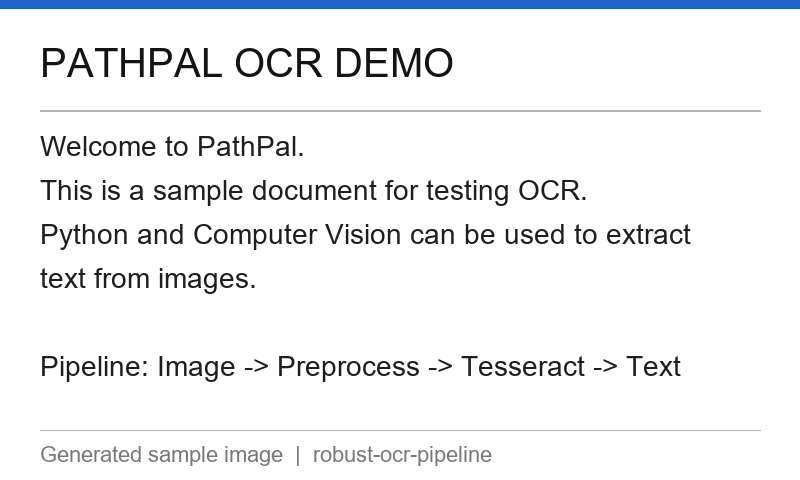

# Robust OCR Pipeline

> A lightweight Python OCR pipeline using OpenCV preprocessing and Tesseract OCR for extracting text from images.

---

## Overview

This project demonstrates a practical, end-to-end OCR pipeline in Python. It reads an input image, applies a series of preprocessing steps using OpenCV to improve text legibility, and then feeds the result to Tesseract OCR to extract the text.

The code is intentionally modular — each preprocessing step is a self-contained function, and the OCR backend (Tesseract) is isolated in its own module so it can be swapped for PaddleOCR or EasyOCR without touching the rest of the codebase.

---

## Features

- **Grayscale conversion** — eliminates colour noise that confuses OCR engines.
- **Image resizing** — upscales small images to meet Tesseract's optimal DPI range.
- **NL-Means denoising** — suppresses JPEG compression and scan artifacts.
- **CLAHE contrast enhancement** — improves local contrast without over-brightening.
- **Otsu / Adaptive thresholding** — binarises the image for crisp black-and-white text.
- **CLI interface** — --image, --output, --resize-factor, --threshold, --debug.
- **Clear error messages** — missing files, unreadable images, and missing Tesseract all produce human-readable errors.

---

## Pipeline

`
Input Image
     |
Image Validation
     |
Grayscale Conversion
     |
Resize / Denoising
     |
Contrast Enhancement (CLAHE)
     |
Thresholding (Otsu or Adaptive)
     |
Tesseract OCR
     |
Extracted Text
`

---

## Project Structure

`
robust-ocr-pipeline/
|
+-- src/
|   +-- __init__.py
|   +-- preprocess.py   # OpenCV preprocessing pipeline
|   +-- ocr.py          # Tesseract OCR wrapper
|   +-- main.py         # CLI entry point
|
+-- sample/
|   +-- input.png       # Sample input image
|   +-- output.txt      # Expected OCR output
|
+-- tests/
|   +-- test_preprocess.py
|
+-- requirements.txt
+-- README.md
+-- .gitignore
+-- LICENSE
`

---

## Installation

### 1. Clone the repository

`ash
git clone https://github.com/your-username/robust-ocr-pipeline.git
cd robust-ocr-pipeline
`

### 2. Create a virtual environment (recommended)

`ash
python -m venv .venv

# Windows
.venv\Scripts\activate

# macOS / Linux
source .venv/bin/activate
`

### 3. Install Python dependencies

`ash
pip install -r requirements.txt
`

### 4. Install Tesseract OCR

Tesseract is a separate system binary and must be installed independently.

| Platform | Instructions |
|----------|-------------|
| **Windows** | Download the installer from [UB-Mannheim/tesseract](https://github.com/UB-Mannheim/tesseract/wiki). Run it and note the installation path (e.g. C:\Program Files\Tesseract-OCR). |
| **macOS** | rew install tesseract |
| **Ubuntu / Debian** | sudo apt install tesseract-ocr |

After installation, verify it works:

`ash
tesseract --version
`

### 5. Configure Tesseract path (Windows only, if needed)

If 	esseract is not on your PATH, set the TESSERACT_CMD environment variable:

`ash
# PowerShell
 = "C:\Program Files\Tesseract-OCR\tesseract.exe"

# Command Prompt
set TESSERACT_CMD=C:\Program Files\Tesseract-OCR\tesseract.exe

# macOS / Linux
export TESSERACT_CMD=/usr/local/bin/tesseract
`

---

## Usage

### Basic usage

`ash
python -m src.main --image sample/input.png
`

### Save output to a file

`ash
python -m src.main --image sample/input.png --output sample/output.txt
`

### Advanced options

`ash
# Use adaptive thresholding instead of Otsu
python -m src.main --image sample/input.png --threshold adaptive

# Disable upscaling (for already high-resolution images)
python -m src.main --image sample/input.png --resize-factor 1.0

# Enable debug logging
python -m src.main --image sample/input.png --debug
`

### Missing file example

`ash
python -m src.main --image does_not_exist.png
# Error: Input image not found: does_not_exist.png
`

---

## Sample Input / Output

### Input image

### Extracted output

`
PATHPAL OCR DEMO

Welcome to PathPal.
This is a sample document for testing OCR.
Python and Computer Vision can be used to extract
text from images.
`

---

## Running Tests

`ash
pytest tests/ -v
`

Tests that require Tesseract are automatically skipped when Tesseract is not installed, with a clear message explaining why.

---

## Approach

### Why preprocess before OCR?

Raw photographs and scanned documents frequently contain noise, uneven lighting, and low contrast that significantly degrade OCR accuracy. The OpenCV preprocessing pipeline brings the image closer to the clean, high-contrast binary representation that Tesseract was trained on.

Each step targets a specific problem:

| Step | Problem solved |
|------|---------------|
| Grayscale | Removes colour channels that add no textual information |
| Resize (2x) | Small text falls below Tesseract's optimal ~300 DPI range |
| NL-Means denoising | JPEG/scan grain corrupts character edges |
| CLAHE | Uneven illumination creates locally dark or washed-out regions |
| Thresholding | Tesseract reads binary images most reliably |

### Why Tesseract?

Tesseract is the most widely deployed open-source OCR engine, has first-class Python bindings via pytesseract, and is straightforward to install on all major platforms. For a hiring challenge this makes reproduction simple. The OCR module is intentionally thin so that PaddleOCR or EasyOCR can replace it with minimal changes.

---

## Limitations

OCR accuracy decreases with:

- **Heavy blur** — NL-Means denoising helps slightly but cannot recover severely blurred text.
- **Poor / uneven lighting** — CLAHE partially compensates, but extreme shadows may still cause failures.
- **Significant skew or perspective distortion** — deskewing is not implemented in the current pipeline.
- **Very small text** — upscaling mitigates this, but very small fonts remain challenging.
- **Complex or cluttered backgrounds** — adaptive thresholding handles moderate variation; heavy patterns will degrade results.
- **Handwritten text** — Tesseract is trained primarily on printed text; handwriting accuracy is low.

No accuracy claims are made for images outside the clean-document domain this pipeline is designed for.

---

## Future Improvements

- **Deskewing** — detect and correct page rotation before thresholding.
- **Perspective correction** — four-point transform to flatten warped pages.
- **Deblurring** — Wiener or deep-learning deblurring as a preprocessing step.
- **Confidence-score filtering** — use pytesseract.image_to_data to filter low-confidence words.
- **PaddleOCR / EasyOCR comparison** — the modular ocr.py makes this straightforward.
- **Multilingual OCR** — Tesseract supports 100+ languages via lang parameter.
- **Batch processing** — extend main.py to accept a directory of images.

---

## License

MIT
